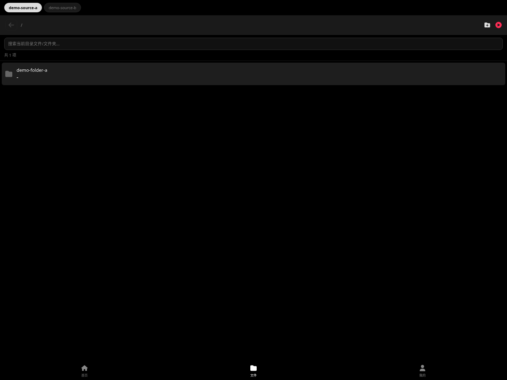
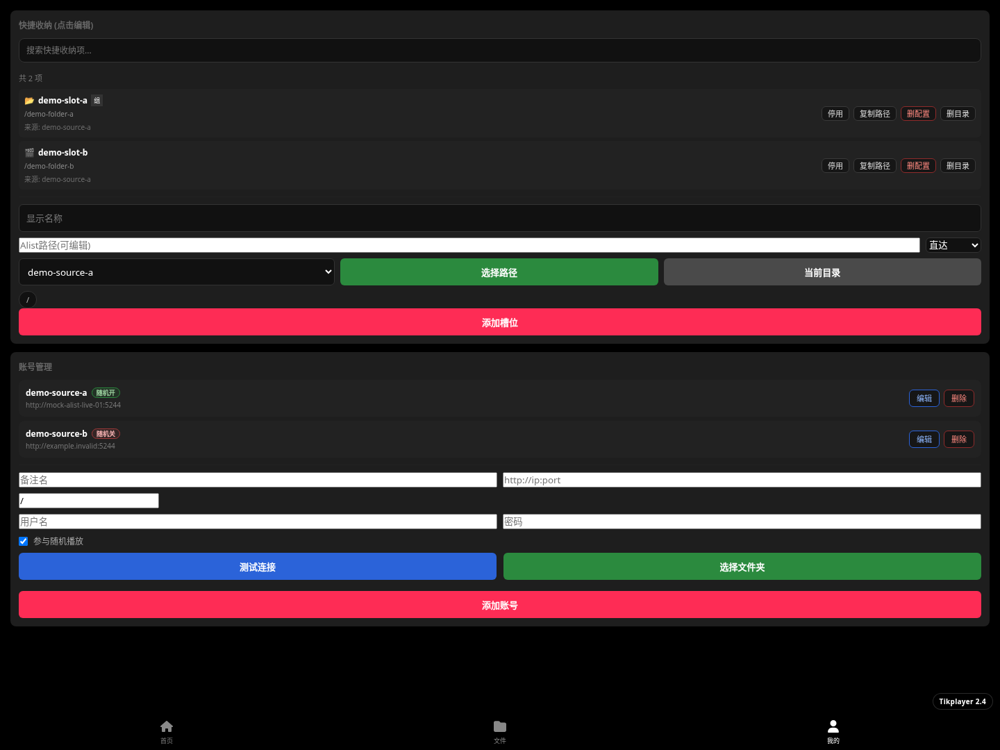
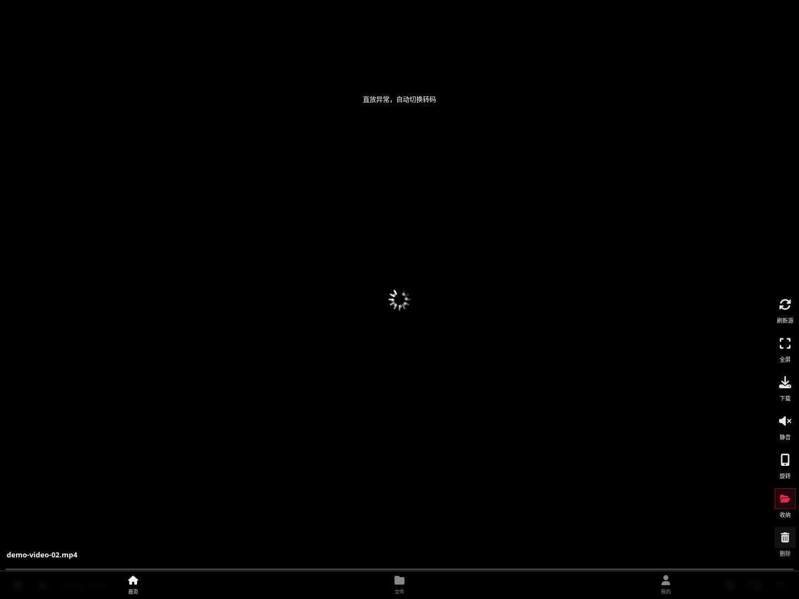

# Tikplayer 2.4



[](https://hub.docker.com/r/leduchuong/tikplayer)
[](https://github.com/leduchuong48-byte/tikplayer/stargazers)
[](https://github.com/leduchuong48-byte/tikplayer/network/members)
[](https://github.com/leduchuong48-byte/tikplayer/issues)
[](#)
[](#)

[English](README_en.md)

> Better alternative to traditional media dashboards for E-ink devices.

Tikplayer 2.4 is a lightweight self-hosted video browser and player built for NAS, homelab, and low-power displays. It connects to AList sources, keeps playback simple, and exposes the core actions you actually need on a touch-first screen.

## Why this tool?（为什么要做它）

很多家庭影音面板和通用文件浏览器在墨水屏、小尺寸触控屏和低功耗设备上并不好用：入口层级深、切换慢、播放失败后恢复困难、日常整理动作分散。Tikplayer 把播放、文件浏览、快捷收纳和账号配置压缩到一个轻量界面里，适合需要快速打开、快速播放、快速整理的人。

## 当前版本亮点

- 面向 AList 源的轻量视频浏览与播放界面，适合 NAS 和自托管场景
- 首页直接提供刷新源、全屏、下载、静音、旋转、收纳、删除等高频操作
- 文件页支持多源切换、目录浏览、搜索、整目录播放、右键/长按操作
- 设置页支持账号管理、路径选择、快捷收纳目录配置
- 内置直接播放与转码回退能力，支持 `qsv`、`vaapi`、`cpu` 三种转码后端

## UI 界面展示

以下截图为人工审核通过后的主要工作界面，按页面计划顺序展示。






## ⚡️ Quick Start (Run in 3 seconds)

```bash
docker run --rm -p 1015:8000 leduchuong/tikplayer:latest
```

## Docker Compose（Portainer / NAS 可直接粘贴）

```yaml
services:
  tikplayer:
    image: leduchuong/tikplayer:latest
    container_name: tikplayer
    restart: unless-stopped
    ports:
      - "1015:8000"
    env_file:
      - .env
    devices:
      - /dev/dri:/dev/dri
    group_add:
      - "44"
      - "109"
    environment:
      - LIBVA_DRIVER_NAME=iHD
      - TRANSCODE_BACKENDS=qsv,vaapi,cpu
    volumes:
      - ./image:/app/image
      - ./data:/app/data
      - ./static:/app/static:ro
    shm_size: "2gb"
```

## 配置说明

- 默认服务端口是 `8000`，常见宿主机映射示例是 `1015:8000`
- 首次进入后在“我的”页面配置 AList 地址、用户名、密码和扫描目录
- 推荐保留 `/dev/dri` 映射，以启用 `qsv` 或 `vaapi` 硬件转码
- 若没有可用显卡，应用会回退到 `cpu` 转码

## 主要能力

- AList 账号登录、目录选择、源配置持久化
- 随机播放、目录播放、媒体下载、全屏和旋转控制
- 快捷收纳目录、重命名、删除、移动等整理动作
- 启动时刷新媒体池，并提供手动刷新与状态接口
- PWA 安装提示、离线页、基础服务工作线程支持

## GitHub Topics

`#nas` `#homelab` `#selfhosted` `#alist` `#eink` `#media-player` `#docker`

## Support

- Issues: https://github.com/leduchuong48-byte/tikplayer/issues
- Repository: https://github.com/leduchuong48-byte/tikplayer
- Docker Hub: https://hub.docker.com/r/leduchuong/tikplayer

## 免责声明

使用本项目即表示你已阅读并同意 [免责声明](DISCLAIMER.md)。请只在你有权访问和处理的媒体源上使用它。
